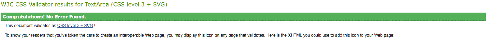
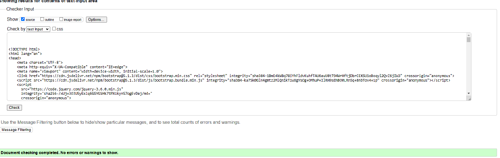
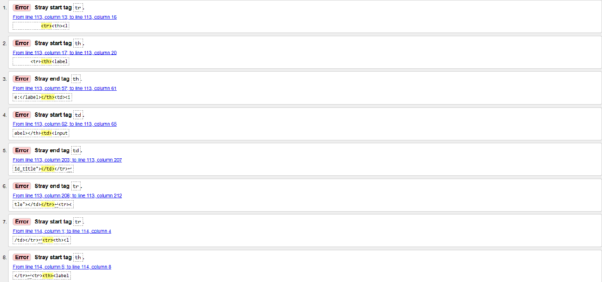

# [LINK FOR LIVE VIEW](https://forum-knasten.herokuapp.com/)

# Content

1. Introduction
2. User experience (UX)
3. Colors
4. The page
5. User stories
6. Testing
7. Deploying to Heroku
8. Validation
9. Tech used
10. Credits

# Introduction
I choose to do this cause gaming has been a hobby of mine since I was just a little kid.
So I wanted to make a place where gamers could gather round and chat/post about their favorite parts.

# User experience (UX)

In this picture you can see the original post at the top and then the comments stacks underneath:

In this picture you can the different game choices:

In this picture you can see the comment creation page:

In this picture you can see the post creation page:

This is the registration page, and it does not require a e-mail to sign-up:

This is the logout page:

This is the login page:

As you can see from the pictures above, registration is easy and dosen't require any mail to signup.
Even if you do not sign up you are able to view post made by other users you will not be able to like or comment however.
Besides from that there is not much to say everything is self explanatory.

# Colors
As can be seen in the pictures above, I have chosen to go with a darker theme website. 
I have chosen this beacuse, me myself when I am reading on internet finds it less straining on the eyes with darker backgrounds.

# User Stories
My sole purpose of this site was to build something to share ideas and knowledge about the games we love.
And perhaps you can find your next gaming companion or promote your twitch channel. The choice is yours.

| **As a**   | **I would like to**              | **So that I can**                             | **requisites**     | **status** |
|------------|----------------------------------|-----------------------------------------------|--------------------|------------|
| USER       | add post                         | ask questions                                 | authenticated user |    Done    |
| USER       | comment on posts                 | answer questions                              | authenticated user |    Done    |
| USER       | like post                        | show my appreciation                          | authenticated user |    Done    |
| USER       | visit my profile page            | change my profile settings                    | authenticated user | Postponed  |
| USER       | be able to upload images         | share images of variations                    | authenticated user |    Done    |
| USER       | be able to open posts            | read the content and participate              |         -          |    Done    |
| USER       | browse posts by game             | find the right post more easily               |         -          |    Done    |
| USER       | be able to style my posts        | present my information in a neat and nice way | authenticated user |    Done    |
| USER       | be able to remove my posts       | remove content I no longer wish to display    | authenticated user |    Done    |
| USER       | be able to remove my comments    | correct any mistakes I may do                 | authenticated user |    Done    |
| USER       | request removal of my account    | get any personal info deleted                 | authenticated user | Postponed  |
| USER       | PM other users                   | have an conversation in private               | authenticated user | Postponed  |
| USER       | see number of post in a category | see if it is an category with much attendance |         -          |    Done    |
| SITE OWNER | disable misbehaving users        | keep the site clean                           | superuser          | Postponed  |
| SITE OWNER | browse account removal requests  | remove the accounts in question               | superuser          | Postponed  |
| SITE OWNER | Manage any posts and comments    | remove explicit content                       | superuser          |    Done    |

## Features To Consider ##

- Direct Message System (User to User)
- Comment chains (reply system)
- Verification either email or another social media account.
- Create Profilepage
- Add total likes to profile
- Add top posters of the week board

# Testing

Automated testing has not been implemented in this project. So instead I have done all the testing manually.

* **Implementation:** Edit button and code to make it possible for a super user to edit any post.
* **Test:** To test this implementation, I wrote some test posts with different accounts. Then logged in to my super user and tried to edit a couple posts.
* **Result:** All posts was edited however I noticed it changed the original author.
* **Verdict:** Test passed it does edit the post however some fixes are needed to make sure author doesn't change.

* **Implementation:** Delete button and viewcode to make it possible for a super user to delete any post.
* **Test:** To test this implementation, I used some of all the test post I written and went on to delete it.
* **Result:** The posts were removed and everything was working as expected
* **Verdict:** Test passed without any troubles.

* **Implementation:** Auto selection of game on add post view
* **Test:** To test this implementation, I clicked my way in to add post page, and filled it out with some test data without choosing game.
* **Result:** It worked, after posting it jumped back to the right category again and the post were visible. However if trying to access this view from home page with url would cause an error
* **Verdict:** Test passed it did what it was supposed to however this error needs to be addressed and fixed.

* **Implementation:** Add edit possibilty for the author of an post
* **Test:** To test this implementation, I went in on an account created an post. Then tried to edit the content and the title.
* **Result:** It all worked good, when changing title and content then applying it sent me back to the postview with all changes applied.
* **Verdict:** Test passed as expected without any bugs present.

* **Implementation:** Add the function to like a post.
* **Test:** To test this implementation, I logged in to one of my accounts and tried liking different posts.
* **Result:** It liked like it was supposed to however if I logged out of the account and liked it threw and 500 error. 
* **Verdict:** Test passed but bugs were present. Need to add authentication to like view, and send them to login page instead if clicking when logged out.

* **Implementation:** Making summernote more responsive
* **Test:** To test this implementation, I went in to add post and changed the device to some different phones and sizes.
* **Result:** After this implementation it does scale much better, however summernote does not seem to be preferable on phones.
The toolbar at the top does not scale well so you get an horizontal scroll inside the notepad.
* **Verdict:** Test passed but does need some review in future development

# Bugs
* **Problem:** 500 Error on signup if email is filled out.
* **Cause:** Email verifications without any setup in django.
* **Solution:** Removed email verification by adding ACCOUNT_EMAIL_VERIFICATION = 'None' to settings.py. This to stop an email from trying to be sent.

* **Problem:** Form error when adding comment."No Author ID"
* **Cause:** Script was missing accidently been deleted, which filled out the hidden input
* **Solution:** Checked the old commmit and copied and pasted in the code again.

* **Problem:** By editing a post it changes the user. For instance if a superuser needs to fix some content.
* **Cause:** When editing it uses the same form as adding, so the script filled out the wrong author-id.
* **Solution:** Changed out variable for author from user to post.user and it all worked.

* **Problem:** Trying to access add-post page from the homepage throws an error.
* **Cause:** It couldn't find the HTTP_REFFERER since there is none when trying to access it this way.
* **Solution:** Added an if statement to check if HTTP_REFFERER exists in add-post and if it doesn't it hops over the code for prepoulating game field.

# Unresolved Issues

The only known issue for me right now is summernote, it still does not look good but it is functional. At a later time I would like to see if there is, any other text editor more suited for phones. If there is one to be used it would make the phone use much easier and hopefully it would look neater aswell.

# Validation
* To validate my python files I ran them all through [PEP8 Online Check](http://pep8online.com/)
Below you can find the results of the tests. Only things left are some too long lines which can be seen in the document of "PEP8 settings.py"

### LINKS TO VALIDATION TEXT ###
- [PEP8 admin.py](readme/txt/result_admin.py.txt)
- [PEP8 apps.py](readme/txt/result_apps.py.txt)
- [PEP8 contexts.py](readme/txt/result_contexts.py.txt)
- [PEP8 forms.py](readme/txt/result_forms.py.txt)
- [PEP8 models.py](readme/txt/result_models.py.txt)
- [PEP8 urls.py](readme/txt/result_urls.py.txt)
- [PEP8 views.py](readme/txt/results_views.py.txt)
- [PEP8 settings.py](readme/txt/results_settings.py.txt)

* To validate my HTML I ran them through [HTML Validator](https://validator.w3.org/)
And everything turned out all right except for summernotes widget which has alot of errors, which is an cause of how summernotes are built.
This can be seen in picture number 3 all theese faults origins from summernote widget.

### HTML Validations Images and Links ####
1. 
2. 
3. 
4. [Login Validation](readme/images/login_validation.png)
5. [Logout Validation](readme/images/logout_validation.png)
6. [Post Detail Validation](readme/images/post_detail_validation.png)
7. [Post List Validation](readme/images/postlist_validation.png)
8. [Register Validation](readme/images/register_validation.png)

# Tech used

Main parts of the site is HTML5 and CSS3.

- [GitHub](https://www.github.com)
Storing my files while working.
    
- [Gitpod](https://www.gitpod.io)
Platform on which I write the code.
    
- [FontAwesome](https://fontawesome.com)
From here I have imported some icons to improve site design.
     
- [PEP8 Validation](http://pep8online.com/)
CSS jigsaw validator.
    
- [Heroku](https://heroku.com/)
For deployment of the site and application.
        
- [Django](https://www.djangoproject.com/)
Framework used to build the site and application.

- [SummerNotes](https://summernote.org/)
Used to customise input fields from user.

# Credit
Credit goes out to my mentor Richard Wells for all the awesome help during this project.

And also to Stackoverflow for having some quick answers [Link to Stackoverflow](https://stackoverflow.com/)

PROBLEMS: Footer not sticking to bottom on postview. This was caused by an div not being closed if comments hadn't been made on a post a user choose to view.

