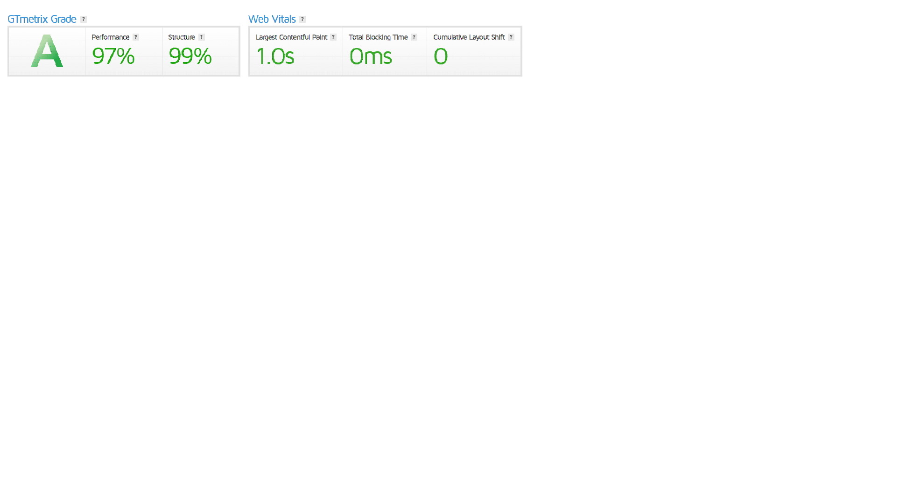

# [LINK FOR LIVE VIEW](https://forum-knasten.herokuapp.com/)

# Content

1. Introduction
2. User experience (UX)
3. Colors
4. The page
5. User stories
6. Testing
7. Deploying to Heroku
8. Validation
9. Tech used
10. Credits

# Introduction
I choose to do this cause gaming has been a hobby of mine since I was just a little kid.
So I wanted to make a place where gamers could gather round and chat/post about their favorite parts.

# User experience (UX)

In this picture you can see the original post at the top and then the comments stacks underneath:

In this picture you can the different game choices:

In this picture you can see the comment creation page:

In this picture you can see the post creation page:

This is the registration page, and it does not require a e-mail to sign-up:

This is the logout page:

This is the login page:

As you can see from the pictures above, registration is easy and dosen't require any mail to signup.
Even if you do not sign up you are able to view post made by other users you will not be able to like or comment however.
Besides from that there is not much to say everything is self explanatory.

# Colors
As can be seen in the pictures above, I have chosen to go with a darker theme website. 
I have chosen this beacuse, me myself when I am reading on internet finds it less straining on the eyes with darker backgrounds.

# User Stories
As a devloper I wanted to build a page full of game post and memes. Perhaps even add a news channel to gather all the news about the games in question.
I wanted to start a community and build something that works.

## User ##

- As a user I want to be able to **add post** so that **I can spread message** (Done)
- As a user I want to be able to **add comments** so that **I can simulate a conversation** (Not Done)
- As a user I want to be able to **style my blogpost/comment** so that **I can give my message a style that represents it better** (Done)
- As a user I want to be able to **add images to post** so that **I can show the readers what Iam talking about** (Done)
- As a user I want to be able to **like a post** so that **I can show my appreciation regarding the content** (Done)
- As a user I want to be able to **like a comment** so that **I can show my appreciation regarding the content** (Done)

## Features To Consider ##

- Direct Message System (User to User)
- Comment chains (reply system)
- Verification either email or another social media account.
- Create Profilepage
- Add total likes to profile
- Add top posters of the week board

# Testing

The website has been manually tested for all functions that has been implemented, however add_comments view does not work at the time of writing this.
Besides this there is no bug found that has been left unfixed.

I had some problem with the database. It said something along the lines of "post.id could not be found", this happend after I added a new field to my model.
After this I had to fake-initial migrate and rerun server to get it up running again.

Except from all the manual testing I also ran it through both lighthouse and GTmetrix, result shown below.

## Further Testing
After deployment everything was tested manually again to make sure nothing broke in the transfer. Still got problems with add_comment at the time of writing this.

Both CSS and HTML has been tested to make sure it is linked and ready for our visitors. 
Both CSS and HTML has been run through validators. Results are shown below.

# Validation

### LINKS TO VALIDATION IMAGES ###
- [pep8 settings.py](media/images/settingspep8.png)
- [pep8 forms.py](media/images/formpep8.png)
- [pep8 models.py](media/images/modelpep8.png)
- [pep8 views.py](media/images/viewspep8.png)
- [pep8 urls.py](media/images/pathpep8.png)

# Tech used

Main parts of the site is HTML5 and CSS3.

- [GitHub](https://www.github.com)
Storing my files while working.
    
- [Gitpod](https://www.gitpod.io)
Platform on which I write the code.
    
- [FontAwesome](https://fontawesome.com)
Social media icons
     
- [PEP8 Validation](http://pep8online.com/)
CSS jigsaw validator.
    
- [Heroku](https://heroku.com/)
For deployment of the site and application.
        
- [Django](https://www.djangoproject.com/)
Framework used to build the site and application.

- [SummerNotes](https://summernote.org/)
Used to customise input fields from user.

# Credit
Credit goes out to my mentor Richard Wells for all the awesome help during this project.

And also to Stackoverflow for having some quick answers [Link to Stackoverflow](https://stackoverflow.com/)

PROBLEMS: Footer not sticking to bottom on postview. This was caused by an div not being closed if comments hadn't been made on a post a user choose to view.